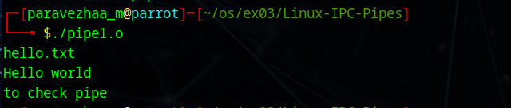

# Linux-IPC--Pipes
Linux-IPC-Pipes

# Ex03-Linux IPC - Pipes

# AIM:
To write a C program that illustrate communication between two process using unnamed and named pipes

# DESIGN STEPS:

### Step 1:

Navigate to any Linux environment installed on the system or installed inside a virtual environment like virtual box/vmware or online linux JSLinux (https://bellard.org/jslinux/vm.html?url=alpine-x86.cfg&mem=192) or docker.

### Step 2:

Write the C Program using Linux Process API - pipe(), fifo()

### Step 3:

Testing the C Program for the desired output. 

# PROGRAM:

## C Program that illustrate communication between two process using unnamed pipes using Linux API system calls

#include <stdio.h>
#include <stdlib.h>
#include <sys/types.h>
#include <sys/wait.h>
#include <unistd.h>

int main() {
    int status;

    printf("Running ps with execl\n");
    if (fork() == 0) {
        execl("/bin/ps", "ps", "-f", NULL);   // full path required
        perror("execl failed");
        exit(1);
    }
    wait(&status);

    if (WIFEXITED(status)) {
        printf("Child exited with status: %d\n", WEXITSTATUS(status));
    } 
    else {
        printf("Child did not exit successfully\n");
    }

    printf("Running ps with execlp (without full path)\n");
    if (fork() == 0) {
        execlp("ps", "ps", "-f", NULL);   // execlp searches PATH
        perror("execlp failed");
        exit(1);
    }
    wait(&status);

    if (WIFEXITED(status)) {
        printf("Child exited for execlp with status: %d\n", WEXITSTATUS(status));
    } 
    else {
        printf("Child did not exit successfully\n");
    }

    printf("Done.\n");
    return 0;
}

## OUTPUT

## C Program that illustrate communication between two process using named pipes using Linux API system calls

## OUTPUT

# RESULT:
The program is executed successfully.
