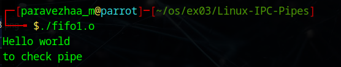

# Linux-IPC--Pipes
Linux-IPC-Pipes

# Ex03-Linux IPC - Pipes

# AIM:
To write a C program that illustrate communication between two process using unnamed and named pipes

# DESIGN STEPS:

### Step 1:

Navigate to any Linux environment installed on the system or installed inside a virtual environment like virtual box/vmware or online linux JSLinux (https://bellard.org/jslinux/vm.html?url=alpine-x86.cfg&mem=192) or docker.

### Step 2:

Write the C Program using Linux Process API - pipe(), fifo()

### Step 3:

Testing the C Program for the desired output. 

# PROGRAM:

## C Program that illustrate communication between two process using unnamed pipes using Linux API system calls

#include <stdio.h>
#include <stdlib.h>
#include <sys/types.h>
#include <sys/wait.h>
#include <unistd.h>

int main() {
    int status;

    printf("Running ps with execl\n");
    if (fork() == 0) {
        execl("/bin/ps", "ps", "-f", NULL);   // full path required
        perror("execl failed");
        exit(1);
    }
    wait(&status);

    if (WIFEXITED(status)) {
        printf("Child exited with status: %d\n", WEXITSTATUS(status));
    } 
    else {
        printf("Child did not exit successfully\n");
    }

    printf("Running ps with execlp (without full path)\n");
    if (fork() == 0) {
        execlp("ps", "ps", "-f", NULL);   // execlp searches PATH
        perror("execlp failed");
        exit(1);
    }
    wait(&status);

    if (WIFEXITED(status)) {
        printf("Child exited for execlp with status: %d\n", WEXITSTATUS(status));
    } 
    else {
        printf("Child did not exit successfully\n");
    }

    printf("Done.\n");
    return 0;
}

## OUTPUT

## C Program that illustrate communication between two process using named pipes using Linux API system calls

#include <stdio.h>
#include <stdlib.h>
#include <unistd.h>
#include <fcntl.h>
#include <sys/types.h>
#include <sys/stat.h>
#include <string.h>
#include <sys/wait.h>

#define FIFO_FILE "/tmp/my_fifo"
#define FILE_NAME "hello.txt"

void server();
void client();

int main() {
    pid_t pid;

    // Create FIFO if it doesn't exist
    if (access(FIFO_FILE, F_OK) == -1) {
        mkfifo(FIFO_FILE, 0666);
    }

    pid = fork();

    if (pid > 0) {
        // Parent process → server
        sleep(1);   // allow client to start
        server();
        wait(NULL); // wait for child
        unlink(FIFO_FILE); // remove FIFO
    }
    else if (pid == 0) {
        // Child process → client
        client();
    }
    else {
        perror("Fork failed");
        exit(EXIT_FAILURE);
    }

    return 0;
}

// Server: reads from file and sends to FIFO
void server() {
    int fifo_fd, file_fd;
    char buffer[1024];
    ssize_t bytes_read;

    file_fd = open(FILE_NAME, O_RDONLY);
    if (file_fd == -1) {
        perror("Error opening hello.txt");
        exit(EXIT_FAILURE);
    }

    fifo_fd = open(FIFO_FILE, O_WRONLY);
    if (fifo_fd == -1) {
        perror("Error opening FIFO");
        exit(EXIT_FAILURE);
    }

    while ((bytes_read = read(file_fd, buffer, sizeof(buffer))) > 0) {
        write(fifo_fd, buffer, bytes_read);
    }

    close(file_fd);
    close(fifo_fd);
}

// Client: reads from FIFO and prints
void client() {
    int fifo_fd;
    char buffer[1024];
    ssize_t bytes_read;

    fifo_fd = open(FIFO_FILE, O_RDONLY);
    if (fifo_fd == -1) {
        perror("Error opening FIFO");
        exit(EXIT_FAILURE);
    }

    while ((bytes_read = read(fifo_fd, buffer, sizeof(buffer))) > 0) {
        write(STDOUT_FILENO, buffer, bytes_read);
    }

    close(fifo_fd);
}

## OUTPUT

# RESULT:
The program is executed successfully.
